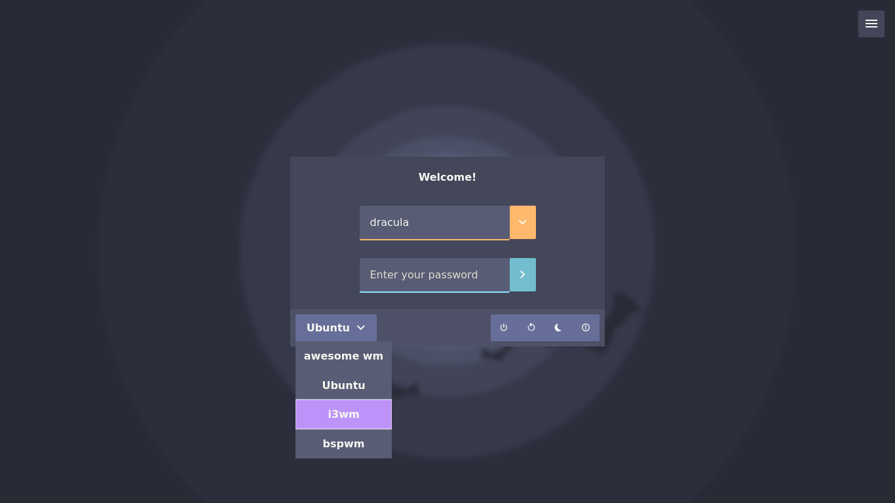
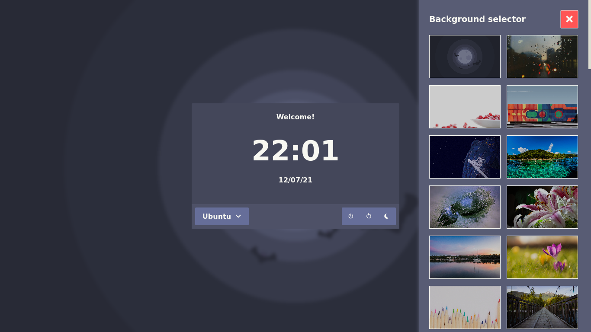

# Web Greeter dracula theme

## Overview

This is a web-greeter theme based on [dracula color scheme][dracula], included with [web-greeter][web-greeter].

Based also on [glorious-theme][glorious] by manilarome.

- Looks good at night, when dracula wakes up
- Simple keyboard navigation
- Vanilla Javascript
- Background selector

## Screenshots

## Installation

This theme is shipped with `web-greeter`. To use it, set the `theme` as `dracula` inside `/etc/lightdm/web-greeter.yml`

## Credits

Dracula theme wallpaper found [here](https://draculatheme.com/wallpaper)

Window blurred background image by [Riley Briggs](https://unsplash.com/photos/cSe3oKQ03OQ) on [Unsplash](https://unsplash.com/)

## TODO

- Battery and brightness support
- Lock indicator
- Translations support

[dracula]: https://github.com/dracula/dracula-theme "Dracula theme"
[web-greeter]: https://github.com/JezerM/web-greeter "Web Greeter"
[glorious]: https://github.com/manilarome/lightdm-webkit2-theme-glorious "Glorious"
