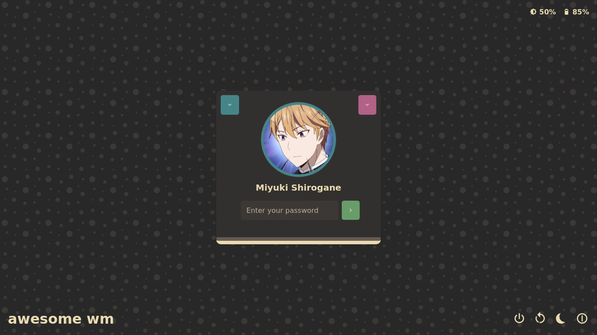
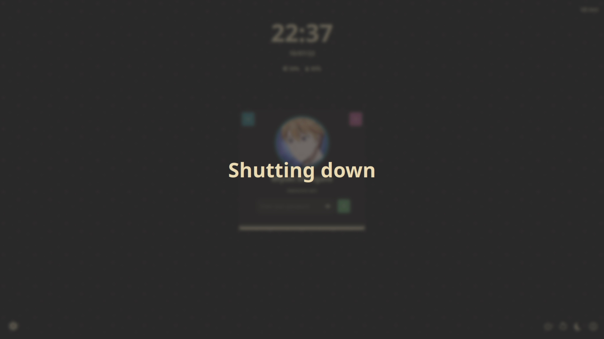

# Web Greeter gruvbox theme

## Overview

This is a web-greeter theme with gruvbox color scheme, included with [web-greeter][web-greeter].

Based on [glorious-theme][glorious] by manilarome.

- It's simple
- Simple keyboard navigation
- Vanilla Javascript
- Includes battery and brightness support
- Gruvbox everywhere!

## Screenshots

## Installation

This theme is shipped with `web-greeter`. To use it, set the `theme` as `gruvbox` inside `/etc/lightdm/web-greeter.yml`

## TODO

- Background selector
- Translations support

[web-greeter]: https://github.com/JezerM/web-greeter "Web Greeter"
[glorious]: https://github.com/manilarome/lightdm-webkit2-theme-glorious "Glorious"
